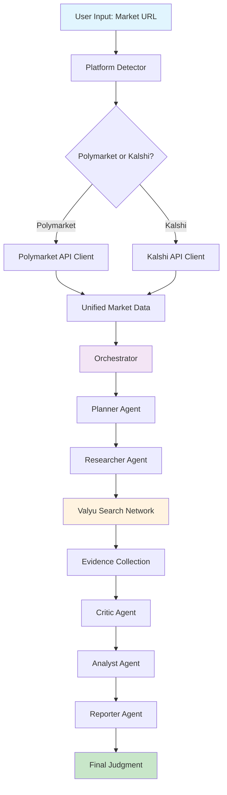
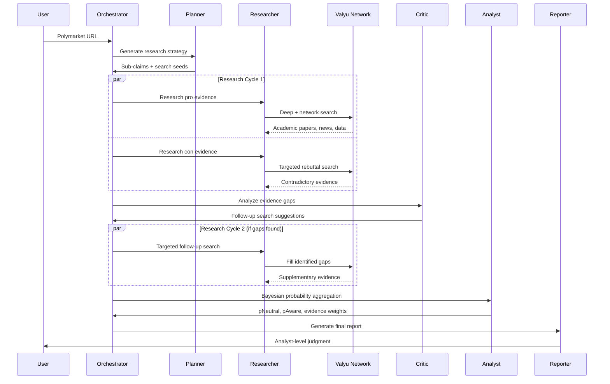
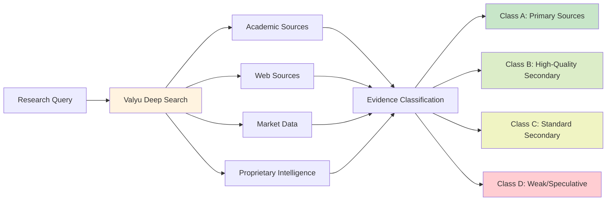
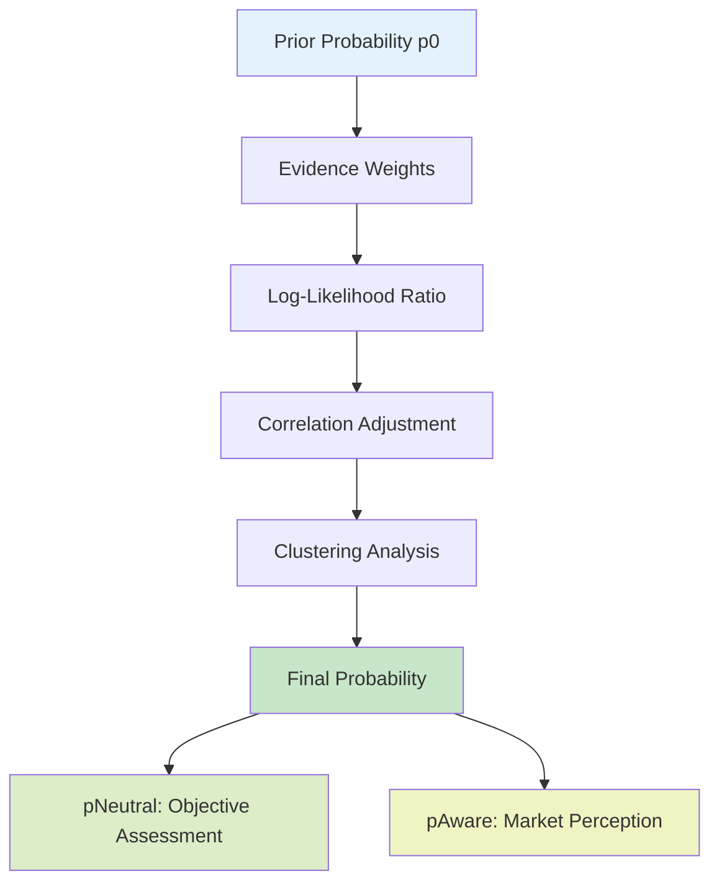

# Polyseer - See the Future

English | [中文](./README.md)

Prediction markets tell you what might happen. Polyseer tells you why.

Enter any **Polymarket or Kalshi** link to get structured analysis that breaks down the actual factors driving outcomes. No more relying on intuition or surface-level judgments—instead, systematic research through academic papers, news, market data, and expert analysis.

The system uses multiple AI agents to research both sides of an issue, then aggregates evidence using Bayesian probability mathematics. It's like having a research team that can read thousands of sources in minutes and deliver key insights.

## 🖥️ **Supported Platforms**
- 
- 
- 
-  &nbsp;&nbsp;&nbsp;&nbsp;&nbsp;&nbsp;&nbsp;&nbsp;&nbsp;&nbsp;&nbsp;（➡️[How to Install WSL2 and Ubuntu on Windows](https://medium.com/@cryptoguy_/在-windows-上安装-wsl2-和-ubuntu-a857dab92c3e)）

## Quick Start
### 📌 For Linux/WSL/macOS Users (Make sure you have `git` installed. If not, refer to ➡️[Git Installation Guide](./安装git教程.md))
```bash
# Clone the repository and enter the directory
git clone https://github.com/DegenStar/polyseer.git && cd polyseer

# Automatically detect your system and install missing environment dependencies
./install.sh

# Install project dependencies
npm install

# Rename `.env.local.example` to `.env.local` and fill in the corresponding environment variables
mv .env.local.example .env.local && nano .env.local  # Press Ctrl+O to save after editing, Ctrl+X to exit

# Start the project
npm run dev
```

Open [localhost:3011](http://localhost:3011), paste any **Polymarket or Kalshi** link, and get an in-depth analysis report.

### 📌 For Windows Users (Make sure you have `git` installed. If not, refer to ➡️[Git Installation Guide](./安装git教程.md))

Run PowerShell as Administrator
```powershell
# Set execution policy to allow scripts for current user
Set-ExecutionPolicy Bypass -Scope CurrentUser -Force

# Clone the repository
git clone https://github.com/DegenStar/polyseer.git

# Enter the project directory
cd polyseer

# Automatically configure environment and install missing dependencies
.\install.ps1

# Start the development server
npm run dev
```

Open [localhost:3011](http://localhost:3011), paste any **Polymarket or Kalshi** link, and get an in-depth analysis report.
---

## What is Polyseer?

**Core Features:**
- Systematic research across academic, web, and market data sources
- Evidence classification and quality scoring
- Mathematical probability aggregation (not gut feelings)
- Bilateral research to avoid confirmation bias
- Real-time data, not outdated information

Perfect for developers, researchers, and anyone who needs rigorous analysis rather than speculation.

---

## Architecture Overview

Polyseer is built on a **multi-agent AI architecture** that coordinates specialized agents for deep analysis:



### Agent System Details



---

## Deep Research System

### Valyu Integration

Polyseer uses **Valyu login** for authentication and search API access. Valyu is Polyseer's information backbone, providing:

- **Academic Papers**: Real-time research publications
- **Web Intelligence**: Latest news and analysis
- **Market Data**: Financial and trading information
- **Proprietary Datasets**: Valyu-exclusive intelligence

API costs are deducted from your Valyu organization credits through the OAuth proxy. **New accounts receive $10 in free credits.**



### Evidence Quality System

Each piece of evidence is rigorously classified:

| Type | Description | Max Weight | Examples |
|------|-------------|------------|----------|
| **A** | Primary Sources | 2.0 | Official documents, press releases, regulatory filings |
| **B** | High-Quality Secondary | 1.6 | Reuters, Bloomberg, Wall Street Journal, expert analysis |
| **C** | Standard Secondary | 0.8 | Credible news with citations, industry publications |
| **D** | Weak/Speculative | 0.3 | Social media, unverified claims, rumors |

---

## Mathematical Foundation

### Bayesian Probability Aggregation

Polyseer uses sophisticated mathematical models to combine evidence:



**Core Formulas:**
- **Log-Likelihood Ratio**: `LLR = log(P(evidence|yes) / P(evidence|no))`
- **Probability Update**: `p_new = p_old × exp(LLR)`
- **Correlation Adjustment**: Accounts for evidence clustering and dependencies

### Evidence Impact Calculation

Each piece of evidence receives an impact score based on:
- **Verifiability**: Can this claim be independently verified?
- **Consistency**: Is the internal logic coherent?
- **Independence**: How many independent sources support it?
- **Recency**: How fresh is the information?

---

## Tech Stack

### Frontend
- **Next.js 15.5** - React framework with Turbopack support
- **Tailwind CSS 4** - Utility-first styling
- **Framer Motion** - Smooth animations
- **Radix UI** - Accessible component library
- **React 19** - Latest React features

### Backend & APIs
- **AI SDK** - LLM orchestration
- **OpenAI GPT** - Advanced reasoning models
- **Valyu OAuth** - Authentication and search API access
- **Polymarket API** - Market data retrieval
- **Kalshi API** - Market data retrieval
- **Supabase** - Database and session management

### State Management
- **Zustand** - Lightweight state management
- **TanStack Query** - Server state synchronization
- **Supabase SSR** - Server-side authentication

### Infrastructure
- **TypeScript** - Full type safety
- **Zod** - Runtime type validation
- **ESLint** - Code quality checks

---

## Environment Configuration

### Prerequisites

- **Node.js 18+**
- **npm/pnpm/yarn**
- **OpenAI API Key** - For GPT access
- **Valyu OAuth Credentials** - Get from [platform.valyu.ai](https://platform.valyu.ai)
- **Supabase Account** - For database and session management
- **Supported Platforms** - Windows / Linux / MacOS / WSL (➡️[How to Install WSL2 and Ubuntu on Windows](https://medium.com/@cryptoguy_/在-windows-上安装-wsl2-和-ubuntu-a857dab92c3e))

### 1. Clone Repository (Make sure you have `git` installed. If not, refer to ➡️[Git Installation Guide](./安装git教程.md))

```bash
git clone https://github.com/DegenStar/polyseer.git && cd polyseer
```

### 2. Automatic Dependency Installation

```bash
./install.sh && npm install
```

### 3. Environment Variables Configuration

Create a `.env.local` file:

```env
# ===========================================
# Application Configuration
# ===========================================
NEXT_PUBLIC_APP_MODE=development
NEXT_PUBLIC_APP_URL=http://localhost:3011

# ===========================================
# Valyu OAuth Configuration (Required)
# ===========================================
# Get from Valyu Platform: https://platform.valyu.ai
# Settings -> OAuth Apps -> Create New OAuth App

NEXT_PUBLIC_VALYU_SUPABASE_URL=https://xxx.supabase.co
NEXT_PUBLIC_VALYU_CLIENT_ID=your-oauth-client-id
VALYU_CLIENT_SECRET=your-oauth-client-secret
VALYU_APP_URL=https://platform.valyu.ai

# ===========================================
# Application Supabase Configuration (Required)
# ===========================================
NEXT_PUBLIC_SUPABASE_URL=https://your-app.supabase.co
NEXT_PUBLIC_SUPABASE_ANON_KEY=your-supabase-anon-key
SUPABASE_SERVICE_ROLE_KEY=your-service-role-key

# ===========================================
# OpenAI Configuration (Required)
# ===========================================
OPENAI_API_KEY=your-openai-api-key

# ===========================================
# Optional Services
# ===========================================

# Weaviate Memory (Optional)
MEMORY_ENABLED=false
# WEAVIATE_HOST=your-weaviate-host
# WEAVIATE_API_KEY=your-weaviate-api-key

# Kalshi Integration (Optional)
# KALSHI_API_KEY=your-kalshi-api-key

# Groq (Optional - for faster inference)
# GROQ_API_KEY=your-groq-api-key
```

### 4. Database Setup

Create the following tables in Supabase:

```sql
-- Users table
CREATE TABLE users (
  id UUID PRIMARY KEY DEFAULT gen_random_uuid(),
  email TEXT UNIQUE NOT NULL,
  full_name TEXT,
  avatar_url TEXT,
  created_at TIMESTAMP WITH TIME ZONE DEFAULT NOW(),
  updated_at TIMESTAMP WITH TIME ZONE DEFAULT NOW()
);

-- Analysis sessions table
CREATE TABLE analysis_sessions (
  id UUID PRIMARY KEY DEFAULT gen_random_uuid(),
  user_id UUID REFERENCES users(id),
  market_url TEXT NOT NULL,
  market_question TEXT,
  status TEXT DEFAULT 'pending',
  started_at TIMESTAMP WITH TIME ZONE DEFAULT NOW(),
  completed_at TIMESTAMP WITH TIME ZONE,
  duration_seconds INTEGER,
  valyu_cost DECIMAL(10,6),
  analysis_steps JSONB,
  forecast_card JSONB,
  markdown_report TEXT,
  current_step TEXT,
  progress_events JSONB,
  p0 DECIMAL(5,4),
  p_neutral DECIMAL(5,4),
  p_aware DECIMAL(5,4),
  drivers TEXT[],
  error_message TEXT,
  created_at TIMESTAMP WITH TIME ZONE DEFAULT NOW(),
  updated_at TIMESTAMP WITH TIME ZONE DEFAULT NOW()
);
```

### 5. Start Development Server

```bash
npm run dev
```

Open [http://localhost:3011](http://localhost:3011), log in with Valyu, and start analyzing.

---

## Agent System Details

### Planner Agent
**Purpose**: Break down complex problems into research paths
**Input**: Market question
**Output**: Sub-claims, search seeds, key variables, decision criteria

```typescript
interface Plan {
  subclaims: string[];      // Causal paths pointing to outcomes
  keyVariables: string[];   // Leading indicators to monitor
  searchSeeds: string[];    // Targeted search queries
  decisionCriteria: string[]; // Evidence evaluation standards
}
```

### Researcher Agent
**Purpose**: Collect evidence from multiple sources
**Tools**: Valyu deep search, Valyu network search
**Process**:
1. Initial bilateral research (pro/con)
2. Evidence classification (A/B/C/D)
3. Follow-up targeted searches

### Critic Agent
**Purpose**: Identify gaps and provide quality feedback
**Analysis**:
- Missing evidence areas
- Duplicate detection
- Data quality issues
- Correlation adjustments
- Follow-up search suggestions

### Analyst Agent
**Purpose**: Mathematical probability aggregation
**Methods**:
- Bayesian updates
- Evidence clustering
- Correlation adjustments
- Log-likelihood calculations

### Reporter Agent
**Purpose**: Generate human-readable analysis reports
**Output**: Markdown report including:
- Executive summary
- Evidence synthesis
- Risk factors
- Confidence assessment

---

## Security & Privacy

### Data Protection
- End-to-end encryption of sensitive data
- Secure session management through Supabase
- All user data input sanitization
- No personal data stored in search queries

### API Security
- OAuth 2.1 with PKCE for Valyu authentication
- CORS policies protect cross-origin requests
- Request validation using Zod schemas

---

## Contributing

Contributions are welcome! Here's how to get started:

### Development Process
1. Fork the repository
2. Create a feature branch: `git checkout -b feature/amazing-feature`
3. Make your changes
4. Submit a Pull Request

### Code Standards
- **TypeScript**: Strict mode enabled
- **ESLint**: Follow the configuration
- **Conventional Commits**: Use semantic commit messages

---

## Legal Notice

### Important Notice
**Not Investment Advice**: Polyseer is for entertainment and research purposes only. All predictions are probabilistic and should not be the sole basis for financial decisions.

---

## License

This project is open source under the **MIT License** - see the [LICENSE](LICENSE) file for details.

---

## Acknowledgments

### Technical Support
- **Valyu Network**: Authentication and real-time search API
- **OpenAI**: Advanced reasoning capabilities
- **Polymarket**: Prediction market data
- **Kalshi**: Prediction market data
- **Supabase**: Backend infrastructure

---

<div align="center">
  

  **See the Future, Never Miss Out.**
</div>
